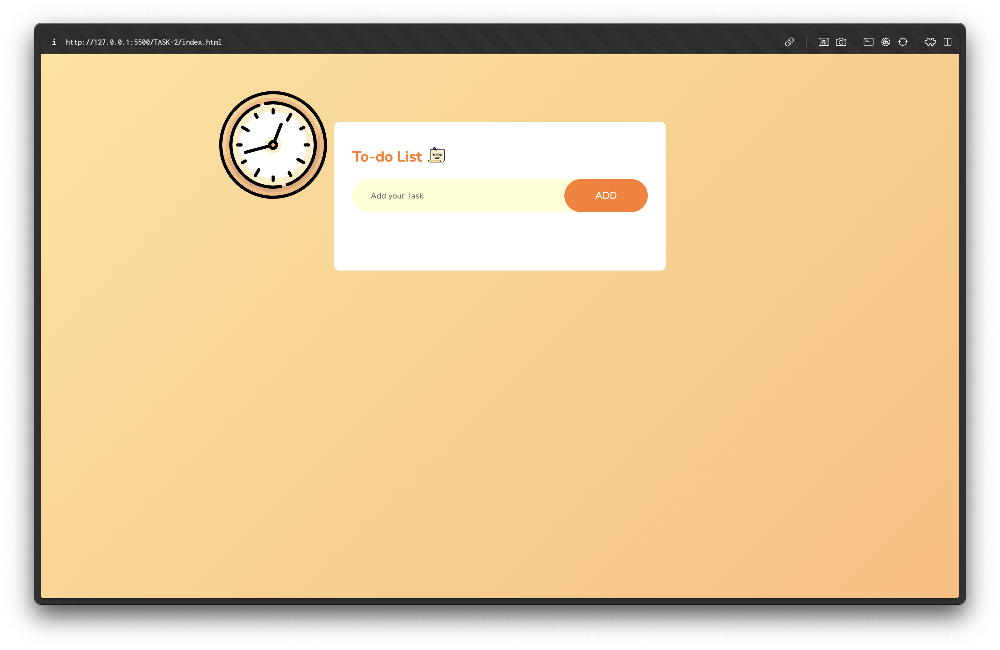

# TO-DO List Web Application

## Overview
This project is a simple TO-DO list web application that allows users to add, delete, and mark tasks as completed. It is built using basic **HTML**, **CSS**, and **JavaScript**, without involving any external frameworks. My main focus for this project was to keep things simple and functional, making it easier to understand and work with the basic functionalities of a TO-DO list.

## Features
- **Add tasks**: Users can add tasks by entering text in an input field and clicking a button.
- **Delete tasks**: Users can remove any task they no longer need.
- **Mark tasks as completed**: Users can mark tasks as done, providing a visual cue for completed tasks.
- **Local storage**: The tasks persist between sessions by storing the task data in the browser’s local storage. This ensures that tasks are not lost even if the page is refreshed or reopened.

## Project Details
- **Design Approach**: The interface is kept simple with a plain white background for adding the tasks and such, focusing on functionality rather than design, but I felt as if the background is too plain and not much is going on so I added a gradient background which changes time to time.
    No external frameworks or libraries were used, as the goal was to maintain simplicity and focus on understanding how basic JavaScript functions work in handling task operations.
  
- **Task Management**: Users can interact with the list by:
  1. Typing a task in the input field.
  2. Clicking the "Add" button to add the task to the list.
  3. Marking tasks as completed by checking them off.
  4. Deleting tasks by clicking the corresponding delete button.

- **Local Storage Implementation**: To ensure data persistence, a custom function called `storeData()` is used. Every time a change is made to the list—whether adding, deleting, or marking tasks as completed—the `storeData()` function updates the browser’s local storage with the current state of the task list. This way, users do not lose their tasks even after closing or refreshing the browser.

## Why No Frameworks?
The project was intentionally kept free from external frameworks to maintain simplicity and avoid the feeling of being constrained by unnecessary complexity. This approach allowed a focus on the core functionality of the TO-DO list and helped in building a better understanding of how JavaScript, HTML, and CSS work together to create a dynamic web application.

