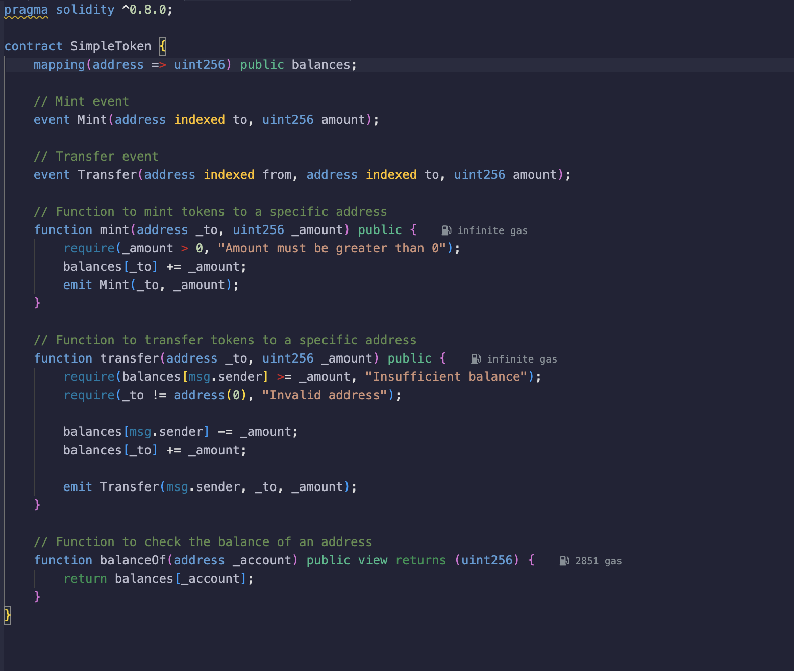

# Simple Smart Contract with Solidity

## Overview
This project involves creating and deploying a simple smart contract using **Solidity**. The task was particularly challenging due to my limited experience with **Web3** and **blockchain technologies**, but it proved to be an invaluable learning opportunity. I used **MetaMask** for monitoring account transactions, and instead of relying on the Ropsten network for testing, I chose a different network.

A basic contract written in Solidity, demonstrating essential contract functions such as recieving, minting, and transfering.

 I used MetaMask to manage Ethereum accounts and monitor transactions on the blockchain network.Instead of using the common Ropsten network, I deployed and tested the contract on an alternative test network.

Compared to my previous tasks (such as building a TO-DO list and a portfolio site), this project involved a steep learning curve. With no prior experience in **blockchain** or **Web3 development**, I had to start by understanding, how **smart contracts** work ,the basics of **Solidity** syntax and structure ,deploying contracts on a test network.

1. **Smart Contract**: The contract is written in Solidity

2. **Testing Network**: Instead of Ropsten, the contract was deployed on an alternative test network for Ethereum-based smart contracts. This required configuring the network settings and ensuring that all transactions were properly verified.

3. **MetaMask Account Management**: I used MetaMask to create a wallet, manage test accounts, and interact with the blockchain. MetaMask provided an interface to track **ETH** balances and transactions during contract deployment and function calls.

## Challenges Faced
Since this was my first time working with Solidity, I had to get familiar with its syntax, contract structure, and the way smart contracts interact with the blockchain. Testing on a Different Network, Configuring an alternative Ethereum test network took time, as I needed to adjust settings and understand how to deploy and test the contract on a new environment. Interfacing the contract with Web3.js and managing transactions with MetaMask required me to dig deep into documentation and tutorials.
