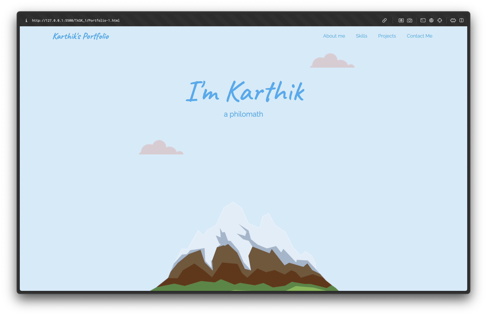
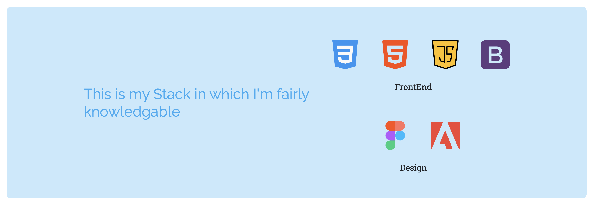
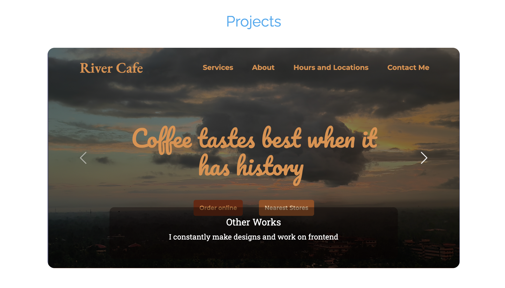

# Portfolio Website

## Overview
This project is a personal portfolio website designed to showcase my skills, experience, and projects in a visually appealing and interactive way. The portfolio serves as a digital resume and a dynamic gallery of my work.

The site opens with a full-screen greeting that sets the tone and introduces the portfolio, with a navbar fixed at the top. The navbar, built using Bootstrap, allows smooth navigation to different sections of the site, ensuring a user-friendly experience across devices.

This section includes a brief introduction, a list of skills, and the technology stack I work with. The stack icons come with hover animations for a subtle, interactive effect. 

A dynamic project gallery built using Bootstrap showcases a variety of projects, which are updated regularly to keep the portfolio fresh and relevant.

At the bottom of the page, visitors can find a contact form to get in touch with me, along with my social media links.

## Design Approach
Compared to simpler projects like the TO-DO list, this portfolio places more emphasis on visual aesthetics, aiming to create a strong first impression. The design is sleek, modern, and minimalistic while ensuring content is easily accessible.

In the skills section, hover animations were added to the stack icons to create a more interactive and engaging user experience. I used Bootstrap to structure the navbar and the dynamic project gallery, which helped ensure responsiveness and layout consistency across devices.

## Project Structure
1. **Navbar**: A Bootstrap-powered navigation bar for easy access to different sections of the portfolio. It remains fixed at the top of the screen.
   
2. **Greeting Section**: A full-screen section that welcomes visitors to the site. It acts as a visual introduction to the portfolio.

3. **About Me & Skills Section**: This section gives a brief overview of who I am, my skills, and the stack I work with.

4. **Dynamic Project Gallery**: The gallery highlights my key projects, and I plan to update it periodically with new projects. It provides an overview of the projects I’ve worked on, giving visitors a look at my work and experience.

5. **Contact Section**: A form that allows users to contact me directly, along with links to my social profiles like LinkedIn and GitHub.

## Technologies Used
- **HTML5**: For the structure and content of the site.
- **CSS3**: For styling and custom animations (hover effects on stack icons).
- **JavaScript**: To add interactivity and dynamic behavior where needed.
- **Bootstrap**: To implement the responsive navbar and the dynamic project gallery.
